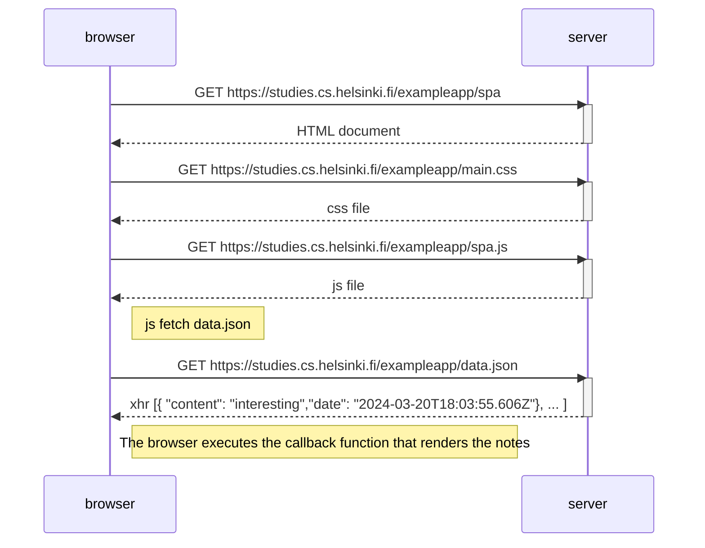

```mermaid
    sequenceDiagram
    participant browser
    participant server

    browser->>server: GET https://studies.cs.helsinki.fi/exampleapp/spa
    
    
    activate server
    server-->>browser: HTML document
    deactivate server

    browser->>server: GET https://studies.cs.helsinki.fi/exampleapp/main.css
    

    activate server
    server-->>browser: css file
    deactivate server

    browser->>server: GET https://studies.cs.helsinki.fi/exampleapp/spa.js
    
    
    activate server
    server-->>browser: js file
    deactivate server

    Note right of browser: js fetch data.json

    browser->>server: GET https://studies.cs.helsinki.fi/exampleapp/data.json
    
    activate server
    server-->>browser: xhr [{ "content": "interesting","date": "2024-03-20T18:03:55.606Z"}, ... ]
    deactivate server

    Note right of browser: The browser executes the callback function that renders the notes
```